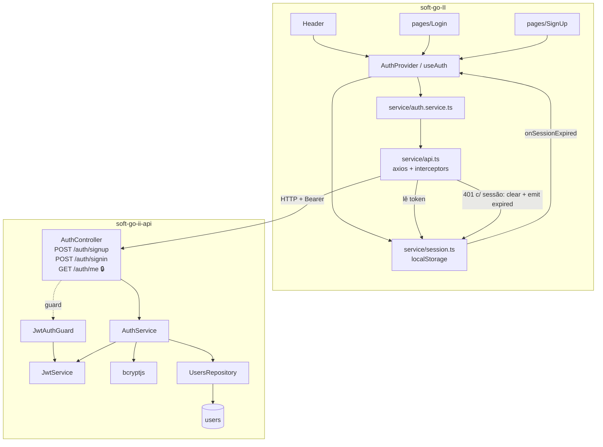

# Auth Design

**Spec**: `.specs/features/auth/spec.md`
**Context**: `.specs/features/auth/context.md`
**Status**: Approved (API: @nestjs/jwt + guard próprio; front: vitest + jsdom + Testing Library)

---

## Architecture Overview

API: dois módulos novos. `users` (entidade + repositório, sem controller) e `auth` (DTOs, service, controller, guard). O JWT é emitido e verificado com `@nestjs/jwt`, sem Passport. O guard é aplicado **só** em `GET /auth/me`; nenhum guard global.

Front: `service/session.ts` (localStorage) é a fonte da verdade da sessão. `service/api.ts` ganha dois interceptors (anexar Bearer; tratar `401`). Um `AuthProvider` (React context) expõe `user`, `signIn`, `signUp`, `signOut` e reage ao evento "sessão expirada" emitido pelo interceptor. Header, `/login` e `/cadastro` consomem o contexto.



### Approaches considered

| | Abordagem | Prós | Contras |
|---|---|---|---|
| **API — recomendada** | `@nestjs/jwt` + `JwtAuthGuard` próprio (~30 linhas) + `bcryptjs` | 2 dependências; código explícito e fácil de revisar; sem estratégia "mágica" | Guard escrito à mão |
| API — alternativa | `@nestjs/passport` + `passport-jwt` + `passport-local` (receita da doc do Nest) | Padrão difundido; estratégias plugáveis para login social no futuro | 5+ dependências e boilerplate para um único fluxo e-mail/senha; login social está fora de escopo |
| **Front — recomendada** | React Context + `session.ts` + interceptors axios | Sem dependência nova; o estado é minúsculo (`user`) | — |
| Front — alternativa | Zustand/Redux para estado de auth | Acesso fora de componentes | Dependência nova para guardar um objeto |

---

## Code Reuse Analysis

### Existing Components to Leverage

| Component | Location | How to Use |
| --------- | -------- | ---------- |
| Padrão de módulo / repositório customizado | `soft-go-ii-api/src/ride-users/*` | `UsersRepository extends Repository<User>` e `UsersModule` no mesmo formato |
| Migration manual | `soft-go-ii-api/src/migrations/1790702705512-AddColumnSpotsInRideTable.ts` | Formato de `CreateTableUsers` |
| Registro de entidades | `src/config/postgres.config.service.ts`, `src/config/data-source.ts` | Adicionar `User` |
| `ConfigModule.forRoot({ isGlobal: true })` | `src/app.module.ts` | `ConfigService` para `JWT_SECRET` / `JWT_EXPIRES_IN` |
| `ValidationPipe` global | `src/main.ts` | Extraído para `setupApp()` e reutilizado nos testes HTTP |
| Instância axios | `soft-go-II/src/service/api.ts` | Ganha interceptors; serviços existentes passam a enviar o Bearer sem mudança |
| `InputForm`, `Button` | `src/components/` | Campos e botão das páginas novas (`Button` com `children`) |
| `Toast(type, message)` | `src/components/Toast.tsx` | Feedback; sempre com mensagem explícita (os padrões falam de "corrida") |
| zod + `zodResolver` + `react-hook-form` | `src/pages/Form.tsx` | Mesmo padrão nos formulários novos |
| Tokens Tailwind / layout de card | `src/index.css`, `pages/Form.tsx` | Visual das páginas novas |

### Integration Points

| System | Integration Method |
| ------ | ------------------ |
| Rotas existentes da API | Intocadas; nenhum guard global (AUTH-23) |
| Banco | Nova tabela `users` via migration `CreateTableUsers`; sem FK com tabelas atuais |
| Swagger | `DocumentBuilder.addBearerAuth()`; `@ApiBody` com `example` nos POST; `@ApiBearerAuth()` em `/auth/me` |
| Front `ride.service.ts` | Sem mudança; passa a carregar o Bearer automaticamente quando logada (inofensivo para rotas abertas) |

---

## Components

### API — `src/users/`

#### User entity — `entities/user.entity.ts`
- **Purpose**: Mapeia a tabela `users` do PRD.
- **Interfaces**: `id: number`, `name: string` (varchar 120), `email: string` (varchar 160, unique), `passwordHash: string` (`name: 'password_hash'`, varchar 255, **`select: false`**), `createdAt: Date` (`name: 'created_at'`, `CreateDateColumn`, `timestamp`).
- **Reuses**: padrão de `ride-user.entity.ts`.

#### UsersRepository / UsersModule
- **Purpose**: Acesso a `users`. `UsersModule` exporta o repositório; sem controller.
- **Interfaces**: `findByEmailWithPassword(email): Promise<User | null>` — `createQueryBuilder('u').addSelect('u.passwordHash').where('u.email = :email', { email })`; demais métodos herdados.

### API — `src/auth/`

#### DTOs — `dto/sign-up.dto.ts`, `dto/sign-in.dto.ts`
- `SignUpDto`: `name` (`@Transform` trim, `@IsString`, `@Length(2, 120)`), `email` (`@Transform` trim+lowercase, `@IsEmail`, `@MaxLength(160)`), `password` (`@IsString`, `@Length(8, 72, { message: 'A senha deve ter entre 8 e 72 caracteres' })`). Mensagens PT-BR.
- `SignInDto`: `email` (`@Transform` trim+lowercase, `@IsString`, `@IsNotEmpty`), `password` (`@IsString`, `@IsNotEmpty`). Sem regras de formato/tamanho no login — qualquer combinação errada cai no `401` genérico.

#### AuthService — `auth.service.ts`
- **Interfaces**:
  - `signUp(dto): Promise<AuthResponse>` — normaliza e-mail; `existsBy({ email })` → `ConflictException('E-mail já cadastrado')`; `bcrypt.hash(password, 10)`; `save`; captura `QueryFailedError` com `driverError.code === '23505'` → mesma `ConflictException` (AUTH-05); retorna `{ accessToken, user: toPublicUser(u) }`.
  - `signIn(dto): Promise<AuthResponse>` — `findByEmailWithPassword`; se nulo **ou** `!bcrypt.compare` → `UnauthorizedException('E-mail ou senha inválidos')` (mesma instância de mensagem nos dois ramos).
  - `me(userId): Promise<PublicUser>` — `findOneBy({ id })`; nulo → `UnauthorizedException`.
  - privados: `issueToken(user)` → `jwtService.signAsync({ sub: user.id, email: user.email })`; `toPublicUser(u)` → `{ id, name, email }` (whitelist explícita, AUTH-03).
- **Dependencies**: `UsersRepository`, `JwtService`, `bcryptjs`.

#### JwtAuthGuard — `jwt-auth.guard.ts`
- **Purpose**: Lê `Authorization: Bearer <t>`, `jwtService.verifyAsync(t)`; sucesso → `request.user = { id: payload.sub, email }`; ausência/erro → `UnauthorizedException('Não autenticado')`.
- **Interface**: `canActivate(ctx): Promise<boolean>`. Reutilizável pelas próximas features via `@UseGuards(JwtAuthGuard)`.

#### AuthController — `auth.controller.ts`
- `POST /auth/signup` → `201` (padrão Nest).
- `POST /auth/signin` → `@HttpCode(200)`.
- `GET /auth/me` → `@UseGuards(JwtAuthGuard)`, `@ApiBearerAuth()`; `authService.me(req.user.id)`.

#### AuthModule / config — `auth.module.ts`, `jwt.config.ts`
- `JwtModule.registerAsync({ inject: [ConfigService], useFactory: jwtConfigFactory })`.
- `jwtConfigFactory(config)`: sem `JWT_SECRET` → `throw new Error('JWT_SECRET não definido')` (AUTH-22); retorna `{ secret, signOptions: { expiresIn: JWT_EXPIRES_IN ?? '7d' } }`.
- Exporta `JwtAuthGuard` e `JwtModule` para uso futuro.

#### setupApp — `src/config/app.setup.ts`
- `setupApp(app)`: `enableCors()` + `ValidationPipe` atual. `main.ts` passa a chamá-la; testes HTTP também (mesmo comportamento de validação/`forbidNonWhitelisted`).

### Front — `soft-go-II/src/`

#### `types/index.ts`
- `User { id: number; name: string; email: string }`, `AuthResponse { accessToken: string; user: User }`, `SignUpPayload { name; email; password }`, `SignInPayload { email; password }`.

#### `service/session.ts`
- **Purpose**: Única porta para a sessão em `localStorage` (chave `softgo.session`, valor `{ accessToken, user }`).
- **Interfaces**: `getSession(): Session | null` (JSON inválido/forma errada → remove a chave e retorna `null`, AUTH-33), `saveSession(s)`, `clearSession()`, `onSessionExpired(cb): () => void`, `notifySessionExpired()`.

#### `service/api.ts`
- Exporta e registra `attachToken(config)` (request: adiciona `Authorization` se há sessão, AUTH-24/31) e `handleUnauthorized(error)` (response: se `status === 401` **e** há sessão → `clearSession()` + `notifySessionExpired()`; sempre rejeita o erro; AUTH-26/34).

#### `service/auth.service.ts`
- `signUp(p): Promise<AuthResponse>` → `POST /auth/signup`; `signIn(p)` → `POST /auth/signin`; `getMe(): Promise<User>` → `GET /auth/me`.

#### `schemas/auth.schema.ts`
- `signUpSchema` (name trim 2–120, email válido ≤160, password 8–72, `confirmPassword` + `refine` → "As senhas não coincidem" em `confirmPassword`) e `signInSchema` (email e senha obrigatórios). Mensagens PT-BR.

#### `context/AuthContext.tsx`
- `AuthProvider` + `useAuth()` → `{ user, signIn, signUp, signOut }`.
- Estado inicial lido de `getSession()` (sem flicker); no mount, se há sessão, chama `getMe()` e atualiza `user` (o `401` é tratado pelo interceptor) — AUTH-25.
- Assina `onSessionExpired`: `setUser(null)`, toast "Sua sessão expirou. Entre novamente.", `navigate('/login')` — AUTH-26.
- `signIn/signUp`: chamam o serviço, `saveSession`, `setUser` (navegação/toast ficam nas páginas). `signOut`: `clearSession()`, `setUser(null)`, `navigate('/login')` — AUTH-30.
- Fica dentro do `BrowserRouter` em `App.tsx` (usa `useNavigate`).

#### `components/GuestOnly.tsx`
- Envolve `/login` e `/cadastro`: logada → `<Navigate to="/" replace />` (AUTH-27).

#### `pages/Login.tsx`, `pages/SignUp.tsx`
- Layout de card no estilo de `Form.tsx`; `InputForm` com mensagem de erro por campo; link cruzado ("Não tem conta? Criar conta" / "Já tem conta? Entrar").
- SignUp: sucesso → toast "Conta criada com sucesso" + `navigate('/')`; `409` → toast com `response.data.message`; outro erro → toast genérico "Não foi possível criar a conta. Tente novamente." (AUTH-12/13).
- Login: sucesso → `navigate('/')`; `401` → toast "E-mail ou senha inválidos"; outro erro → toast genérico (AUTH-17/18).
- `confirmPassword` nunca vai no payload (AUTH-32).

#### `components/InputForm.tsx` (alteração compatível)
- Nova prop opcional `error?: string` renderizada abaixo do campo; `Form.tsx` não muda.

#### `components/Header.tsx`
- Deslogada: `NavLink` "Entrar" / "Criar conta". Logada: "Olá, {primeiro nome}" + botão "Sair" (`signOut`). Primeiro nome via `firstName(name)` em `utils/`.

#### `Routes.tsx`
- `/login` → `<GuestOnly><Login/></GuestOnly>`, `/cadastro` → `<GuestOnly><SignUp/></GuestOnly>`.

---

## Data Models

### users (migration `CreateTableUsers`)

```sql
CREATE TABLE "users" (
  "id" SERIAL PRIMARY KEY,
  "name" VARCHAR(120) NOT NULL,
  "email" VARCHAR(160) NOT NULL,
  "password_hash" VARCHAR(255) NOT NULL,
  "created_at" TIMESTAMP NOT NULL DEFAULT now(),
  CONSTRAINT "UQ_users_email" UNIQUE ("email")
);
-- down: DROP TABLE "users"
```

```typescript
// API
interface AuthResponse { accessToken: string; user: PublicUser }
interface PublicUser { id: number; name: string; email: string }
interface JwtPayload { sub: number; email: string; iat: number; exp: number }
```

**Relationships**: nenhuma nesta feature (ride/ride_users não referenciam users ainda).

---

## Error Handling Strategy

| Error Scenario | Handling | User Impact |
| -------------- | -------- | ----------- |
| E-mail duplicado (pré-checagem ou `23505`) | `409` "E-mail já cadastrado" | Toast com a mensagem; fica em `/cadastro` |
| Validação de DTO | `400` do `ValidationPipe` (mensagens PT-BR) | Front já valida antes; se escapar, toast genérico |
| Credenciais inválidas | `401` "E-mail ou senha inválidos" | Toast; fica em `/login` |
| Token ausente/inválido/expirado em `/auth/me` | Guard → `401` | Interceptor limpa sessão, toast "Sua sessão expirou…", vai para `/login` |
| `JWT_SECRET` ausente | Factory lança na inicialização | API não sobe; mensagem clara no console |
| `localStorage` corrompido | `getSession()` remove a chave e retorna `null` | Usuária vê o app deslogado, sem erro |
| Erro de rede / 5xx no login/cadastro | `catch` genérico | Toast "Não foi possível … Tente novamente." |

---

## Testing Strategy

| Camada | Ferramenta | Cobre |
| ------ | ---------- | ----- |
| API unit — `auth.service.spec.ts` | vitest, repositório mockado com `vi.fn()`, `JwtService` real com segredo de teste | AUTH-01, 02, 04, 05, 09, 14, 15, 16, 19, 20 |
| API HTTP — `auth.controller.spec.ts` | `@nestjs/testing` + supertest + `setupApp()`; `UsersRepository` substituído por fake em memória (sem banco) | AUTH-03, 06, 07, 08, 21, 32 e contrato de status codes |
| API config — `jwt.config.spec.ts`, guard metadata | vitest | AUTH-22, AUTH-23 (nenhum guard nos controllers existentes) |
| Front unit — schemas, session, interceptors, `firstName` | vitest | AUTH-10, 11, 24, 26, 31, 33, 34 |
| Front componentes — Login, SignUp, Header, GuestOnly, AuthProvider | vitest + jsdom + @testing-library/react (`axios` mockado) | AUTH-12, 13, 17, 18, 25, 27, 28, 29, 30 |
| Verificação manual | App rodando + Postgres local | Migration real, Swagger, fluxo ponta a ponta |

Front: `vitest` (v5, compatível com Vite 8), `jsdom`, `@testing-library/react`, `@testing-library/dom`, `@testing-library/user-event` como devDependencies; script `"test": "vitest run"`; `environment: 'jsdom'` no `vite.config.ts`. Testes importam `describe/it/expect` de `vitest` explicitamente (o `tsc -b` inclui `src/`).

---

## Risks & Concerns

| Concern | Location (file:line) | Impact | Mitigation |
| ------- | -------------------- | ------ | ---------- |
| Config do `ValidationPipe` só existe inline em `main.ts` | `soft-go-ii-api/src/main.ts:10-16` | Testes HTTP validariam com regras diferentes da produção | Extrair `setupApp()` e usar nos dois lugares |
| bcrypt usa só os primeiros 72 **bytes**; o limite do spec é 72 **caracteres** | `auth/dto/sign-up.dto.ts` (novo) | Senha com acentos/emoji perto de 72 chars teria a cauda ignorada | Aceito: caso extremo; registrado. ⚠️ Não confirmei se `bcryptjs@3` trunca em silêncio ou lança acima de 72 bytes — verificar na implementação e cobrir com teste |
| Senha em texto puro (requisito crítico do PRD) | `auth.service.ts` (novo) | Reprovação da review | `passwordHash` com `select: false`; `toPublicUser` com whitelist; testes AUTH-02/03 inspecionam o objeto salvo e o corpo das respostas |
| Token em `localStorage` (XSS) e sem revogação | `soft-go-II/src/service/session.ts` (novo) | Token roubado vale até 7 dias | Aceito pela usuária; dívida registrada (cookie httpOnly / revogação quando houver rota sensível) |
| `Toast` tem mensagens padrão específicas de "corrida" | `soft-go-II/src/components/Toast.tsx:5-8` | Mensagem errada se chamado sem texto | Páginas novas sempre passam mensagem explícita |
| `InputForm` não exibe erro por campo; `Form.tsx` depende de `required` HTML | `soft-go-II/src/components/InputForm.tsx:9` | AUTH-11 exige mensagem abaixo do campo | Prop opcional `error`, compatível com o uso atual |
| e2e existente testa `GET /` "Hello World", que não existe | `soft-go-ii-api/test/app.e2e-spec.ts:21-26` | `test:e2e` já falha hoje e exige banco | Fora do escopo; não usar e2e como gate desta feature |
| `@ApiBody` de ride-users com `required: ['rideId, name']` (string única) | `soft-go-ii-api/src/ride-users/ride-users.controller.ts:15` | Swagger mostra required errado | Fora do escopo; apenas registrado |
| Front sem testes hoje | `soft-go-II/package.json` | Sem gate automatizado para o front | Adicionar vitest + RTL (ver Testing Strategy) |
| `tsconfig.build.tsbuildinfo` modificado na API | `soft-go-ii-api/` (git status) | Commit acidental | Commits com `git add` de caminhos explícitos |

---

## Tech Decisions

| Decision | Choice | Rationale |
| -------- | ------ | --------- |
| Biblioteca JWT | `@nestjs/jwt@^12` sem Passport | Uma estratégia só; menos dependências |
| Hash | `bcryptjs@^3`, custo 10 | JS puro (sem build nativo no Windows), tipos inclusos, API compatível com `bcrypt` |
| Ocultar hash | `select: false` na coluna + `toPublicUser` | Defesa em profundidade: mesmo um `find` futuro não traz o hash |
| Normalização de e-mail | `@Transform` no DTO + unique no banco | Valor já normalizado chega ao service; constraint resolve corrida |
| Guard | Explícito por rota (`@UseGuards`), nunca global | Mantém rotas atuais abertas (AUTH-23) |
| Redirecionamento no 401 | Evento em `session.ts` assinado pelo `AuthProvider` | Interceptor axios vive fora do React e não tem `navigate` |
| Estado inicial da sessão | Otimista (lê `localStorage`) + revalida com `/auth/me` | Sem tela piscando; token inválido é derrubado pelo interceptor |
| Testes do front | vitest + jsdom + Testing Library | Necessário para gate por task; só devDependencies |

> Decisões de nível de projeto registradas em `.specs/STATE.md` como AD-001 (auth/guard/sessão) e AD-002 (testes no front).
