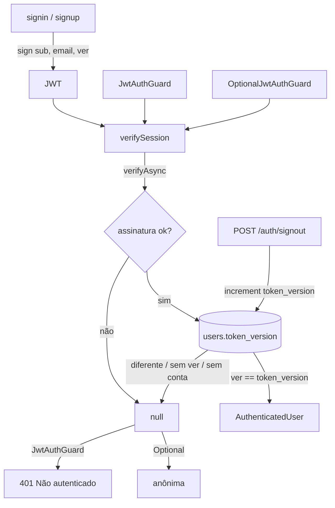

# Revogar Sessões ao Sair Design

**Spec**: `.specs/features/revoke-token/spec.md`
**Status**: Approved (2026-10-08)

---

## Architecture Overview

O token passa a carregar `ver`, a versão de sessão da conta. Os dois guards usam uma função única, `verifySession`, que confere a assinatura e depois compara `ver` com `users.token_version`. `POST /auth/signout` incrementa a coluna de forma atômica. O front apaga a sessão local antes de chamar a API e manda o token direto no header, para que um `401` do signout não dispare o aviso de sessão expirada.

---

## Code Reuse Analysis

| Component | Location | How to Use |
| --------- | -------- | ---------- |
| `JwtAuthGuard` / `OptionalJwtAuthGuard` | `soft-go-ii-api/src/auth/` | Os dois passam a chamar `verifySession`; o contrato externo continua o mesmo |
| `UsersRepository` | `soft-go-ii-api/src/users/users.repository.ts` | `findOneBy({ id })` no guard; `increment({ id }, 'tokenVersion', 1)` no signout |
| `AuthService.issueToken` | `soft-go-ii-api/src/auth/auth.service.ts` | Ganha `ver: user.tokenVersion` no payload |
| Migration `AddColumnPhoneInUsersTable` | `soft-go-ii-api/src/migrations/1791413863720-...` | Mesmo formato para `ADD COLUMN` |
| `AuthContext.signOut` | `soft-go-II/src/context/AuthContext.tsx` | Passa a chamar `authService.signOut(token)` depois de limpar a sessão |
| Interceptor `handleUnauthorized` | `soft-go-II/src/service/api.ts` | Só age quando há sessão. Limpar antes da chamada evita o toast de expiração no signout |

---

## Components

### Migration `AddTokenVersionInUsersTable` + `User.tokenVersion` (API)

- `up`: `ALTER TABLE "users" ADD "token_version" integer NOT NULL DEFAULT 0`. `down`: `DROP COLUMN "token_version"`.
- Entidade: `@Column({ name: 'token_version', type: 'int', nullable: false, default: 0 }) tokenVersion: number`.

### `verifySession` (API)

- **Location**: `soft-go-ii-api/src/auth/verify-session.ts`
- **Interface**: `verifySession(jwtService, usersRepository, authorization?: string): Promise<AuthenticatedUser | null>`. Devolve `null` se o esquema não for Bearer, a assinatura falhar, `ver` não for número, a conta não existir ou `ver !== user.tokenVersion`.
- **Used by**: `JwtAuthGuard` (`null` → `UnauthorizedException('Não autenticado')`) e `OptionalJwtAuthGuard` (`null` → segue anônima).

### `AuthService` (API)

- `issueToken(user)` → `{ sub, email, ver: user.tokenVersion }`.
- `signOut(userId)` → `usersRepository.increment({ id: userId }, 'tokenVersion', 1)`. É atômico no banco (`SET token_version = token_version + 1`).

### `AuthController.signOut` (API)

- `@Post('signout') @HttpCode(204) @UseGuards(JwtAuthGuard) @ApiBearerAuth()` → `authService.signOut(request.user.id)`.

### Front

- `authService.signOut(accessToken)` → `api.post('/auth/signout', null, { headers: { Authorization: 'Bearer <token>' } })`.
- `AuthContext.signOut`:
  1. lê o token da sessão;
  2. `clearSession()`, `setUser(null)`, `navigate('/login')`;
  3. dispara `authService.signOut(token)` e ignora qualquer erro.

  Sair é sempre imediato para a usuária, e o servidor revoga em seguida.

---

## Error Handling Strategy

| Error Scenario | Handling | User Impact |
| -------------- | -------- | ----------- |
| Token revogado numa rota com login | `401` "Não autenticado" | O interceptor mostra "Sua sessão expirou" e leva para `/login` |
| Token revogado no mural | Anônima | O mural aparece sem telefones |
| Signout falha (rede / 401 / 500) | Erro ignorado; a sessão local já foi apagada | Sai normalmente. Se o servidor não recebeu a chamada, o token antigo vale até expirar (comportamento de hoje) |

---

## Risks & Concerns

| Concern | Location (file:line) | Impact | Mitigation |
| ------- | -------------------- | ------ | ---------- |
| Uma consulta a `users` em toda requisição com token | `verifySession` | Latência pequena; `users.id` é PK | Aceito na escolha da opção 1. Registrado em AD-005 |
| Specs HTTP montam os guards com fakes sem `UsersRepository.findOneBy` | `ride.controller.spec.ts`, `ride-users.controller.spec.ts`, `auth.controller.spec.ts` | Specs quebram ao injetar o repositório | Os fakes ganham `findOneBy` com `tokenVersion: 0` e os tokens de teste passam a levar `ver: 0` |
| Todas as usuárias perdem a sessão no deploy | tokens sem `ver` | Precisam entrar de novo uma vez | Está no PRD (Atenção no deploy) |

---

## Tech Decisions

| Decision | Choice | Rationale |
| -------- | ------ | --------- |
| Onde validar a versão | Função compartilhada pelos dois guards | Uma regra só, e o Optional não pode divergir do obrigatório |
| Ordem no logout do front | Limpar a sessão local antes de chamar a API | Evita o toast de sessão expirada e garante a saída mesmo com a API fora |

> **Project-level decision:** AD-005 substitui, na AD-001, "logout é só no cliente" e "o guard não consulta o banco".
