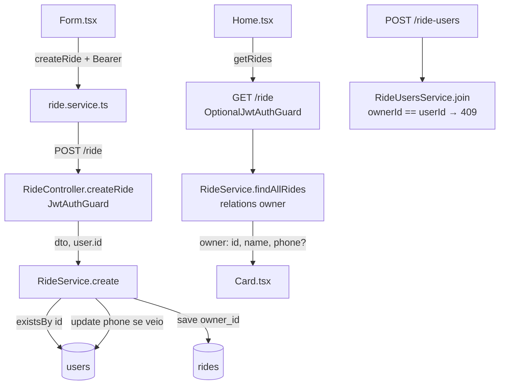

# Dona da Carona Design

**Spec**: `.specs/features/save-rideowner/spec.md`
**Context**: `.specs/features/save-rideowner/context.md`
**Status**: Approved (2026-10-08)

---

## Architecture Overview

A dona vem sempre do token, nunca do body. `POST /ride` ganha `JwtAuthGuard`, como `POST /ride-users` (AD-001/AD-003). `RideService.create` recebe o id da usuária, confere se a conta existe, grava `rides.owner_id` e, se veio `phone`, grava o telefone na conta. `GET /ride` faz join com `users` e devolve `owner`, com o telefone condicionado ao login, pela mesma regra de `toParticipant` (AD-003). No front, `/form` fica atrás de um `RequireAuth`, o formulário perde o nome e o WhatsApp vira opcional, como no modal "Vou junto". O card lê `owner`.



---

## Code Reuse Analysis

### Existing Components to Leverage

| Component | Location | How to Use |
| --------- | -------- | ---------- |
| `JwtAuthGuard`, `AuthenticatedUser` | `soft-go-ii-api/src/auth/jwt-auth.guard.ts` | `@UseGuards(JwtAuthGuard)` em `POST /ride`, igual a `RideUsersController.create` |
| `toParticipant` | `soft-go-ii-api/src/ride/ride.service.ts:16` | Modelo do novo `toOwner` (telefone só com `viewer`), mas com o nome completo |
| `UsersRepository` / `UsersModule` | `soft-go-ii-api/src/users/` | `existsBy({ id })` e `update(id, { phone })`, como em `RideUsersService.join` |
| Regras de telefone do DTO | `soft-go-ii-api/src/ride-users/dto/create-ride-user.dto.ts` | Mesmos decorators (`Transform` com '' = ausente, `IsPhoneNumber('BR')`, `Matches`) no `CreateRideDto` |
| Migration `LinkRideUsersToUsers` | `soft-go-ii-api/src/migrations/1791413956190-LinkRideUsersToUsers.ts` | Mesmo formato: `DELETE`, depois alterar a estrutura. O `down()` restaura a estrutura sem os dados |
| Entidade `RideUser` (`userId` + `user`) | `soft-go-ii-api/src/ride-users/entities/ride-user.entity.ts` | Mesmo par coluna + relação para `ownerId` + `owner` |
| `optionalPhone` | `soft-go-II/src/schemas/phone.schema.ts` | Validação do campo "WhatsApp" no `Form` |
| `useAuth().updateUser` | `soft-go-II/src/context/AuthContext.tsx` | Atualizar a sessão com o telefone depois de publicar (como `Home.handleConfirm`) |
| `GuestOnly` | `soft-go-II/src/components/GuestOnly.tsx` | Espelho invertido para o novo `RequireAuth` |
| "Você vai nesta carona" no `Card` | `soft-go-II/src/components/Card.tsx` | Mesmo estilo para "Sua carona" |

### Integration Points

| System | Integration Method |
| ------ | ------------------ |
| `users` | FK `rides.owner_id → users.id` (`FK_rides_owner`), relação `owner` carregada em `findAllRides` |
| `ride_users` | As inscrições das caronas apagadas saem pelo `ON DELETE CASCADE` que já existe (`FK_ride_users_ride`) |
| Sessão do front | O interceptor de `api.ts` já manda o Bearer e trata o `401` (sessão expirada) |

---

## Components

### Migration `AddOwnerToRides` (API)

- **Purpose**: Ligar `rides` a `users` e remover os dados soltos.
- **Location**: `soft-go-ii-api/src/migrations/<timestamp>-AddOwnerToRides.ts`
- **Interfaces**:
  - `up`:
    1. `DELETE FROM "rides"` (as inscrições saem pelo cascade).
    2. `DROP COLUMN "name"` e `DROP COLUMN "phone"`.
    3. `ADD "owner_id" integer NOT NULL`.
    4. `ADD CONSTRAINT "FK_rides_owner" FOREIGN KEY ("owner_id") REFERENCES "users"("id")`.
  - `down`:
    1. `DELETE FROM "rides"`.
    2. `DROP CONSTRAINT "FK_rides_owner"` e `DROP COLUMN "owner_id"`.
    3. `ADD "phone" character varying(15)` e `ADD "name" character varying(100) NOT NULL`.
- **Reuses**: formato de `LinkRideUsersToUsers`.

### Entidade `Ride` (API)

- **Purpose**: Refletir a nova estrutura.
- **Location**: `soft-go-ii-api/src/ride/entities/ride.entity.ts`
- **Interfaces**: sem `name` e `phone`. Ganha `@Column({ name: 'owner_id', type: 'int', nullable: false }) ownerId: number` e `@ManyToOne('User', { nullable: false }) @JoinColumn({ name: 'owner_id', foreignKeyConstraintName: 'FK_rides_owner' }) owner: User`.
- **Reuses**: o par `userId`/`user` de `RideUser`.

### `CreateRideDto` (API)

- **Purpose**: O body de `POST /ride`.
- **Location**: `soft-go-ii-api/src/ride/dto/create-ride.dto.ts`
- **Interfaces**: sem `name`. `phone` continua opcional, com os decorators do `CreateRideUserDto` (já são os mesmos). Sem `ownerId`, então o `forbidNonWhitelisted` responde `400`.

### `RideService` (API)

- **Location**: `soft-go-ii-api/src/ride/ride.service.ts`
- **Interfaces**:
  - `create(dto: CreateRideDto, ownerId: number): Promise<Ride>`:
    - se `!usersRepository.existsBy({ id: ownerId })`, lança `UnauthorizedException('Não autenticado')` (OWNER-08);
    - confere o tipo de transporte (404, como já faz);
    - salva `{ ...dtoSemPhone, ownerId, transportType }`;
    - depois, se `dto.phone` veio, faz `usersRepository.update(ownerId, { phone })` (OWNER-26).
  - `findAllRides(...)`: `relations` ganha `owner: true`. Cada item sai sem `owner`/`ownerId` crus e com `owner: toOwner(ride.owner, viewer)`.
  - `toOwner(user, viewer?) → { id, name, phone? }`: o nome é completo. `phone` (`user.phone ?? null`) só entra com `viewer`.
- **Dependencies**: `UsersRepository` (`RideModule` importa `UsersModule`).

### `RideController.createRide` (API)

- **Location**: `soft-go-ii-api/src/ride/ride.controller.ts`
- **Interfaces**: `@UseGuards(JwtAuthGuard) @ApiBearerAuth()`; chama `rideService.create(dto, request.user.id)`. O exemplo do Swagger perde `name`, e o `phone` fica descrito como opcional, gravado na conta.

### `RideUsersService.join` (API)

- **Location**: `soft-go-ii-api/src/ride-users/ride-users.service.ts`
- **Interfaces**: logo depois do 404, `if (ride.ownerId === userId) throw new ConflictException('Você não pode se inscrever na sua própria carona')` (OWNER-20).

### Tipos + `ride.service` (Front)

- **Location**: `soft-go-II/src/types/index.ts`, `soft-go-II/src/service/ride.service.ts`
- **Interfaces**:
  - `Owner { id: number; name: string; phone?: string | null }`.
  - `Ride` perde `name` e `phone` e ganha `owner: Owner`.
  - `CreateRidePayload { date; hour; city; complement?; observation?; spotsRide?; transportType: number; phone? }`.
  - `createRide(payload)` envia `phone` só quando preenchido (`...(phone ? { phone } : {})`), como `createRideUser`.

### `RequireAuth` (Front)

- **Purpose**: Proteger `/form`.
- **Location**: `soft-go-II/src/components/RequireAuth.tsx`
- **Interfaces**: `RequireAuth({ children })` → `user ? children : <Navigate to="/login" replace />`. Em `Routes.tsx`, envolve `/form`.
- **Reuses**: `GuestOnly`.

### `Card` (Front)

- **Location**: `soft-go-II/src/components/Card.tsx`
- **Interfaces**:
  - props `owner` no lugar de `name`/`phone`; sai `phoneNull`;
  - inicial e nome vêm de `owner.name`;
  - o WhatsApp aparece quando `showPhones && owner.phone`;
  - quando `currentUserId === owner.id`, mostra "Sua carona" no lugar de "Vou junto"/"Você vai nesta carona" (e tem prioridade sobre lotada).
- **Also**: no `Modal`, o `Pick` troca `"name"` por `"owner"`.

### `Form` (Front)

- **Location**: `soft-go-II/src/pages/Form.tsx`
- **Interfaces**:
  - schema sem `name`; `phone: optionalPhone.optional()`;
  - o campo "WhatsApp" é renderizado só quando `!user?.phone`;
  - o payload sai sem `name` e com `transportType` numérico;
  - em caso de sucesso: `Toast("success")`, `updateUser({ ...user, phone })` se `phone` veio, `navigate("/")`.

### `Home` (Front)

- **Location**: `soft-go-II/src/pages/Home.tsx`
- **Interfaces**: o link "Vou para a soft" aponta para `user ? "/form" : "/login"`. O `Card` já recebe `{...ride}`, com `owner`, e `currentUserId`.

---

## Data Models

```typescript
// API: resposta de GET /ride (por carona)
interface RideResponse {
  id: number;
  date: string;
  hour: string;
  city: string;
  complement?: string;
  observation?: string;
  spotsRide?: number;
  transportType: { id: number; name: string; spots: number | null; spotsRide: number | null };
  owner: { id: number; name: string; phone?: string | null }; // phone só com token válido
  participants: { userId: number; name: string; phone?: string | null }[];
}
```

**Relationships**: `rides.owner_id` N:1 `users.id` (`NOT NULL`, `FK_rides_owner`, sem cascade: usuárias não são apagadas).

---

## Error Handling Strategy

| Error Scenario | Handling | User Impact |
| -------------- | -------- | ----------- |
| `POST /ride` sem token ou com token inválido | `JwtAuthGuard` → `401` "Não autenticado" | Na prática, o front não chega aqui deslogada (`RequireAuth`). Com a sessão expirada, o interceptor desloga e leva para `/login` |
| Token de conta inexistente | `RideService.create` → `401` "Não autenticado" | Igual à sessão expirada |
| `phone` inválido no body | `ValidationPipe` → `400` | O front já bloqueia antes (OWNER-29). Se passar, aparece o toast de erro atual |
| `name`/`ownerId` no body | `forbidNonWhitelisted` → `400` | O front não envia esses campos |
| Dona se inscreve na própria carona | `409` "Você não pode se inscrever na sua própria carona" | O front esconde o botão (OWNER-19). Se passar, o `Home` mostra a mensagem da API no toast (fluxo atual de 409) |

---

## Risks & Concerns

| Concern | Location (file:line) | Impact | Mitigation |
| ------- | -------------------- | ------ | ---------- |
| A migration apaga todas as caronas | nova migration | Perda irreversível das caronas e inscrições da base local | Decisão da usuária. Confirmar com ela antes de rodar no banco local (como no T2 da vou-junto). Testar antes em banco temporário |
| `create` faz `{ ...createRideDto }` direto no `repository.create`: um campo novo no DTO vira coluna sem querer | `soft-go-ii-api/src/ride/ride.service.ts:84` | `phone` iria para uma coluna que não existe mais | Tirar `phone` do spread de forma explícita antes do `create` |
| Telefone gravado depois da carona, sem transação | `RideService.create` | Se o `update` do telefone falhar, a carona existe e o telefone não foi salvo | Ordem escolhida: carona primeiro. A falha do telefone não perde a carona. É o mesmo nível de garantia de `RideUsersService.join` |
| `spotsRide: string` no DTO, com `IsNumber` | `soft-go-ii-api/src/ride/dto/create-ride.dto.ts:41` | Tipo errado, mas fora do escopo | Não mexer. Registrado aqui |
| `Form.tsx` não tem testes | `soft-go-II/src/pages/Form.tsx` | A página que mais muda não tem rede de segurança | O T9 cria `Form.test.tsx` cobrindo cada campo validado (L-003) |
| Duplo toast quando a sessão expira no `Form` | `soft-go-II/src/pages/Form.tsx:89` | "Sua sessão expirou" + "Não foi possível cadastrar..." | Fica assim, como diz a Assumption da spec |

---

## Tech Decisions

| Decision | Choice | Rationale |
| -------- | ------ | --------- |
| Onde validar conta inexistente | `RideService.create` (`existsBy`), não no guard | O guard é compartilhado e não consulta o banco (AD-001). A checagem só importa onde vamos gravar uma FK |
| Formato da resposta | `owner` aninhado, sem `ownerId` na raiz | Uma fonte só, igual a `participants` |
| Proteção de `/form` | Componente `RequireAuth` + o link do Home aponta para `/login` | O link resolve o clique (OWNER-09), e o `RequireAuth` cobre a URL direta (OWNER-10) |

> **Project-level decision:** a AD-003 diz que `POST /ride` segue sem token. Esta feature muda isso. Ao concluir, atualizo a AD-003 (escopo) ou registro uma AD-005: "toda rota que grava dados ligados a uma usuária exige `JwtAuthGuard`".
